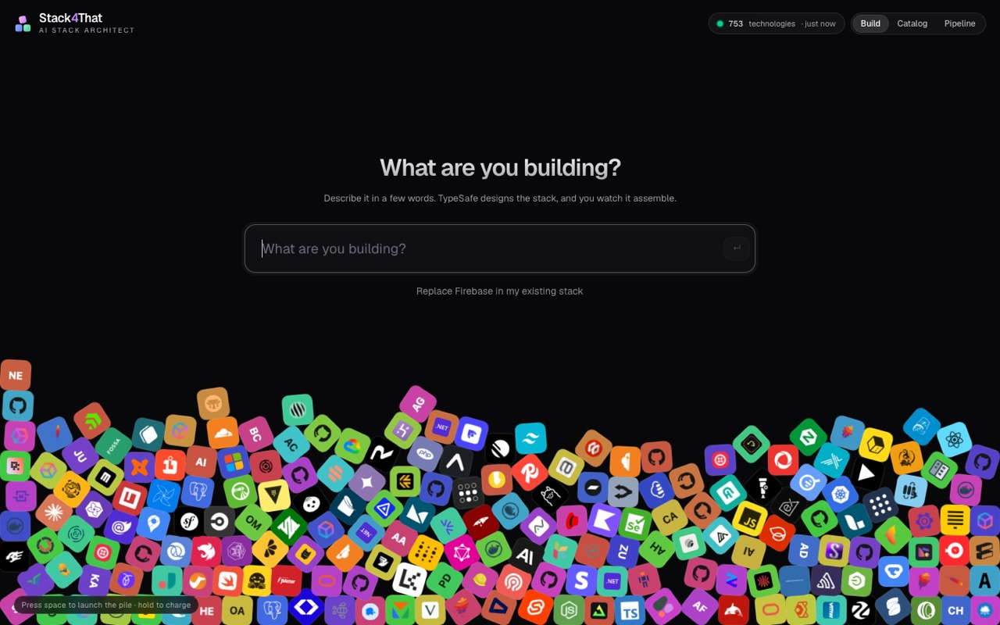
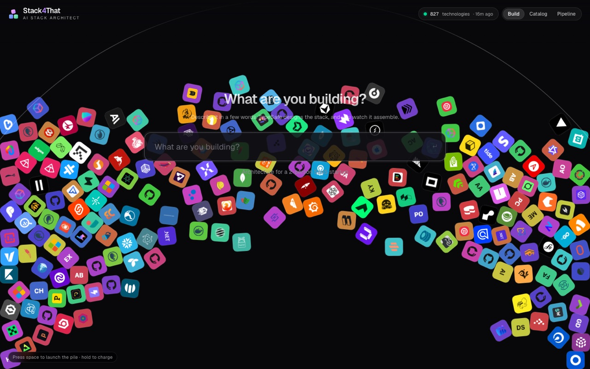
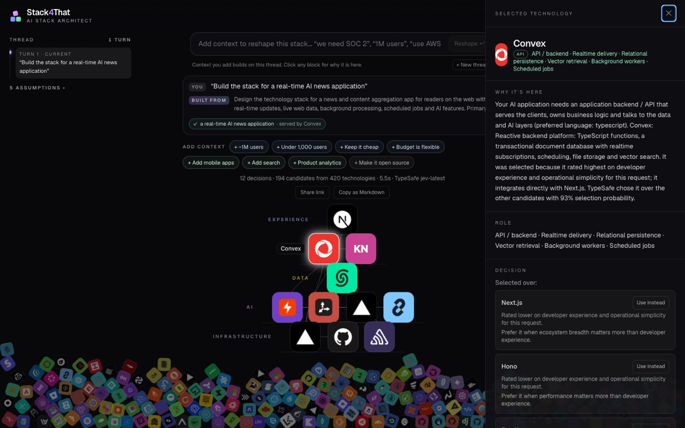
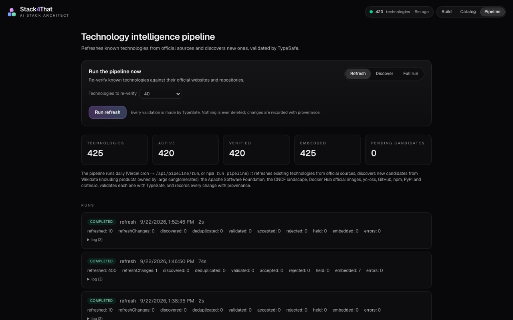

# Stack4That

**Describe what you are building. Watch the stack assemble.**

Stack4That turns a plain-language request such as *"Build the stack for a real-time AI news application"* into a coherent technology architecture, decided by [TypeSafe](https://typesafe.ai) against a continuously refreshed knowledge base of real technologies, and assembled on screen out of physics-driven logo blocks.

Every selection is explained: why the slot exists, why this technology won, what it was chosen over, the calibrated confidence and the sources behind each claim. Candidate identifiers always come from the catalog, so a technology that does not exist cannot be recommended.



---

## Contents

- [What it does](#what-it-does)
- [Quick start](#quick-start)
- [Configuration](#configuration)
- [Command line](#command-line)
- [How it works](#how-it-works)
- [Project layout](#project-layout)
- [Quality gates](#quality-gates)
- [Catalog maintenance](#catalog-maintenance)
- [Deployment](#deployment)
- [License](#license)

---

## What it does

Two experiences share one knowledge base.

**Discover.** The home screen is a universe of technology blocks simulated with Matter.js and drawn on a single canvas, so React never mounts a component per block. Typing glows the blocks that match. Clicking one opens its knowledge-base record with evidence and change history. The whole catalog is browsable at `/catalog`.

The pile is physical. Drag the browser window and the blocks lag behind the box that holds them, crowd toward the trailing wall and settle again. Press space to toss the pile; hold space to charge a bigger launch, up to a full-screen eruption that falls back under gravity.



**Build.** Submit a request and the server streams its work over Server-Sent Events. Candidate blocks light up while retrieval runs, then the chosen ones fly out of the pile on a ballistic path and land in their architecture row. Once settled, relationships are drawn between them.

Click any block for why it is there, the decision it won, tradeoffs, confidence, sources and an implementation snippet written against the actual stack. "Use instead" swaps an alternative in and re-evaluates whatever depended on it. Follow-up messages such as *"make it open source"* or *"use AWS instead"* shake the current stack loose and rebuild it in the same thread, keeping the objectives from earlier turns.



The full pipeline:

```
USER REQUEST → INTENT + CONSTRAINT EXTRACTION → ARCHITECTURE REQUIREMENT GRAPH
→ HYBRID TECHNOLOGY RETRIEVAL → CANDIDATE SETS → TYPESAFE DECISION ENGINE
→ COMPATIBILITY / CONSTRAINT VALIDATION → STACK OPTIMIZATION → FINAL ARCHITECTURE
→ STREAMING VISUAL ASSEMBLY → EXPLANATIONS + IMPLEMENTATION SNIPPETS
```

---

## Quick start

Requirements: Node 20 or newer, and a TypeSafe API key from [console.typesafe.ai](https://console.typesafe.ai/settings/keys). Every decision in the product is made by TypeSafe and there is no fallback engine, so the key is required.

```bash
git clone https://github.com/MoRohn/stack4that.git
cd stack4that
cp .env.example .env.local      # add TYPESAFE_API_KEY
npm install && npm link         # installs the `stack4that` command
stack4that start                # builds if needed, starts in the background, opens the app
```

The first start offers to make `http://stack4that:3333` resolve on this machine, which is one line in `/etc/hosts` and asks for your password. Decline it and the app is served at `http://localhost:3333`; run `stack4that setup` later to change your mind.

The curated seed loads into a local SQLite file on first start, so the app is useful immediately. Run the discovery pipeline whenever you want it to grow.

---

## Configuration

All configuration is environment variables, documented in `.env.example`.

| Variable | Required | Purpose |
| --- | --- | --- |
| `TYPESAFE_API_KEY` | yes | The decision engine. Nothing is decided without it. |
| `TYPESAFE_MODEL` | no | Defaults to `jev-latest`. |
| `DATABASE_URL` | no | libSQL target. Defaults to a local SQLite file; use `libsql://…` for Turso. |
| `DATABASE_AUTH_TOKEN` | with Turso | Auth for a remote libSQL database. |
| `EMBEDDING_PROVIDER` | no | `hash` (default, no downloads), `openai` for any compatible endpoint, or `bge` for local inference. |
| `EMBEDDING_API_URL`, `EMBEDDING_API_KEY`, `EMBEDDING_MODEL`, `EMBEDDING_DIMENSIONS` | with `openai` | Embedding endpoint settings. |
| `CRON_SECRET` | in production | Required to call `/api/pipeline/run`; Vercel sends it as a bearer token. |
| `GITHUB_TOKEN` | no | Raises GitHub rate limits during refresh and discovery. |
| `PIPELINE_ADMIN_TOKEN` | no | Required to launch a pipeline run from the Pipeline page. |
| `PIPELINE_INPROCESS_SCHEDULE`, `PIPELINE_INTERVAL_HOURS` | no | Run the pipeline inside a long-running Node process. |
| `ARCHITECT_RATE_LIMIT` | no | Builds per minute per client, default 20. |
| `STACK4THAT_PORT` | no | Port, default 3333. |

---

## Command line

`npm link` installs `stack4that`, a wrapper around the server so you do not manage processes by hand.

| Command | What it does |
| --- | --- |
| `stack4that start` | Build if the code changed, start in the background, open the browser. `--no-open` to skip. Already running means it just opens. |
| `stack4that stop` / `restart` | Stop or restart the background server. |
| `stack4that status` | Running state, TypeSafe key, hostname, catalog size. |
| `stack4that open` / `logs` | Open the app, or follow `.stack4that/server.log`. |
| `stack4that dev` | Development server with hot reload in the foreground. |
| `stack4that setup` | Add `stack4that` to `/etc/hosts`. |
| `stack4that refresh` | Run the pipeline now. `--mode full\|refresh\|discover`, `--limit N`, `--sources wikidata,apache,…`. |

If another program holds the port, the command names it rather than failing with an address-in-use error.

Working directly with the app:

| Command | What it does |
| --- | --- |
| `npm run architect -- "Build a cheap stack for a two-person startup"` | Run the architect from the terminal and print the stack, decisions and issues. `VERBOSE=1` adds explanations. |
| `npm run pipeline -- --mode full --limit 40` | Run the technology intelligence pipeline once. |
| `npm run pipeline:watch` | Run the pipeline every 24 hours in-process. |
| `npm run build && npm start` | Production build and server. |

---

## How it works

### Decision architecture

Source lives in `src/lib/architect`.

1. **Intent.** One TypeSafe request carries roughly seventy questions about the raw text: a judgment per architecture capability ("does this product need vector retrieval?"), choices for budget, scale, team size, hosting, cloud, language, open-source stance, time to market and data residency, and a role for every catalog technology named in the request (keep, replace, avoid, prefer). Constraints are separated into hard, soft and unknown, and an unknown is stated as an assumption rather than filled in.

   **Every request is accepted.** TypeSafe also picks the closest product archetype, and code composes an explicit brief from the archetype, surfaces, features and constraints. Both the original request and the brief stay on screen. Two words such as *"todo app"* borrow the archetype's typical capabilities; a detailed request is kept as written.

2. **Requirement graph.** Capabilities become slots with request-specific descriptions and dependency edges. Code resolves the conflicts that follow, such as one cross-platform mobile slot instead of two native ones, or local inference instead of hosted APIs when the request is local-first.

3. **Retrieval.** Hybrid scoring per slot over the catalog: a taxonomy gate, BM25, semantic similarity, hard-constraint filtering with soft-preference bonuses, maturity, adoption, evidence freshness, source confidence and integration fit with what is already selected. It returns 10 to 30 candidates and never decides anything.

4. **Decision engine.** For each slot, one TypeSafe request carries the brief, the project context and the shortlist: a choice over candidate identifiers, per-candidate judgments for functional fit, hard-constraint violation and unnecessary complexity, and per-candidate scores on the criteria that matter for this request. Weights are contextual, so a cheap MVP weighs cost and speed while a HIPAA platform weighs security and maturity. There is no universal 0-to-100 score. Responses are normalized into typed results, and the UI never sees a raw payload.

5. **Stack optimizer.** Code checks duplicate capabilities, the same technology in two slots, two backend platforms, cloud vendor conflicts, language and runtime mismatches, deployment and licensing contradictions, compliance gaps and budget contradictions. TypeSafe judges whether each optional slot is genuinely needed, whether overlapping pairs are redundant, whether pairs are compatible and how oversized the stack is. Offending slots are decided again with the offender excluded, and the smallest coherent architecture wins.

6. **Explanations and snippets.** Both are generated from the structured decision rather than written prose, so they reference the criteria that actually decided it and the alternatives that beat the winner on some dimension.

Every stage emits events, so visual assembly starts as soon as the first decision lands rather than when the stack is finished.

### Knowledge base

`Technology` is the canonical entity and companies own many of them. Each record carries taxonomy categories, capabilities, deployment models, languages, integrations, pricing model, maturity, lifecycle status, compliance, evidence rows with source URL, claim and confidence, and full source provenance.

Nothing is ever deleted. Lifecycle changes and every tracked field change are appended to a change log, so a technology that is retired keeps its history and the reason it went.

### Technology intelligence pipeline

```
DISCOVER → FETCH → NORMALIZE → DEDUPLICATE → CLASSIFY → VALIDATE → ENRICH → EMBED → UPSERT → AUDIT
```

**Refresh** re-verifies known technologies against first-party sources: the official website for existence, title, description and shutdown or rename signals, and the official repository for stars, activity, license and archived state. Records with no real description are re-checked first and adopt the project's own repository description, resolving the repository by name or matching homepage when the record has none, so catalog text always comes from the project.

**Discover** pulls candidates from nine sources: Wikidata for software owned by large technology companies, which is how products inside conglomerates surface, plus the Apache Software Foundation catalog, the CNCF landscape, Docker Hub official images, the yc-oss dataset, GitHub search, npm, top PyPI packages and crates.io categories. Candidates are ranked within each source and interleaved so every batch is diverse. A source that fails or times out is logged and skipped.

Validation is TypeSafe's: is this a stack technology, is it developer-facing, is it a low-level dependency rather than something a team chooses, is it a sub-project of something larger, how widely is it used in production, is it active, does the website match, what type and category is it, and which capabilities does it provide. Accepted candidates become verified technologies with evidence for every claim. Uncertain ones, and ones with no usable description yet, are held for a later run. Rejections are recorded with reasons. `/pipeline` shows runs, changes and candidates, and can launch a run with live progress.



### Hardening

- Build endpoints are rate limited per client and cap body size.
- Swaps prefer the server's saved architecture; a client-supplied architecture is never persisted, and rendered links are restricted to http and https.
- Security headers are set globally, and heavy JSON endpoints are compressed and memoized.
- Favicons go through a validated caching proxy, so the browser never calls third parties.
- The curated seed is versioned: when it changes, curated fields merge into existing rows while pipeline-verified facts and all evidence survive.

---

## Project layout

```
bin/                    the stack4that CLI
docs/images/            screenshots used by this README
scripts/                development, evaluation and QA entry points
  maintenance/          one-off catalog curation and repair
src/app/                routes, API handlers, pages
src/components/         React UI
src/lib/architect/      intent, requirements, optimizer, explanations, snippets
src/lib/catalog/        curated seed and logo resolution
src/lib/client/         the Matter.js canvas scene
src/lib/db/             libSQL client and repository
src/lib/pipeline/       discovery, refresh, classification, sources
src/lib/retrieval/      hybrid candidate retrieval
src/lib/typesafe/       the decision engine and client
tests/                  unit and integration tests
```

---

## Quality gates

| Command | What it covers |
| --- | --- |
| `npm test` | Unit and integration tests. Decision tests call TypeSafe for real. |
| `npm run eval` | Decision quality: 22 realistic requests with expectations a senior architect would hold. `ONLY=name` filters, `JSON=1` for machine output. |
| `npm run e2e` | Around 50 browser assertions in real Chrome: assembly timing, frame rate, layout, the detail panel, keyboard access, share and export, swaps, thread continuation, short requests, refresh, error and retry, reduced motion, tablet and mobile, the space-bar launch, window inertia, and zero console errors. |
| `npm run a11y` | axe-core over the home screen idle and built, the detail panel, `/catalog`, `/pipeline` and mobile. Fails on any serious or critical violation. |
| `npm run smoke` | A running server end to end: streaming, swap, persistence, pages. |
| `npm run audit` | Catalog data quality: duplicates, utility noise, missing descriptions or licences, siblings sharing a vendor URL. |
| `npm run visual` | Screenshot walkthrough of the main flows. |
| `npm run lint`, `npm run typecheck` | Static checks. |

The browser suites need Google Chrome installed and a running server. They default to `http://stack4that:3333`; pass another address as the first argument, for example `npm run e2e -- http://localhost:3333`.

---

## Catalog maintenance

These are deliberate, occasional operations. All support `--dry-run`, and none of them delete anything.

| Command | What it does |
| --- | --- |
| `npx tsx scripts/maintenance/prune-thin.ts` | Finds thin entries (stub description, registry-slug name, tiny repository) and asks TypeSafe whether a team would actually choose each one. Adoption and "would anyone pick this" stay separate judgments, so a niche-but-real tool survives and a famous legacy framework does not. |
| `npx tsx scripts/maintenance/prune-utilities.ts` | Retires entries that are dependencies rather than architectural choices: SDKs, middleware, language bindings. |
| `npx tsx scripts/maintenance/merge-duplicates.ts` | Folds a technology that duplicates another into it, keeping every alias and source record. |
| `npx tsx scripts/maintenance/backfill-provenance.ts` | Restores change records for discovered technologies that have none, after an interrupted run. |

---

## Deployment

**Vercel.** Set `TYPESAFE_API_KEY`, `CRON_SECRET` and a libSQL database (`DATABASE_URL=libsql://…` with `DATABASE_AUTH_TOKEN`), since the filesystem is read-only. The cron in `vercel.json` runs the pipeline nightly.

**Any Node host.** The default SQLite file works, with `PIPELINE_INPROCESS_SCHEDULE=1` to keep the catalog fresh.

---

## License

MIT. See [LICENSE](LICENSE).

Technology logos belong to their respective owners and are used for identification. Brand marks come from [Simple Icons](https://simpleicons.org); other icons are fetched through the app's own caching favicon proxy.
